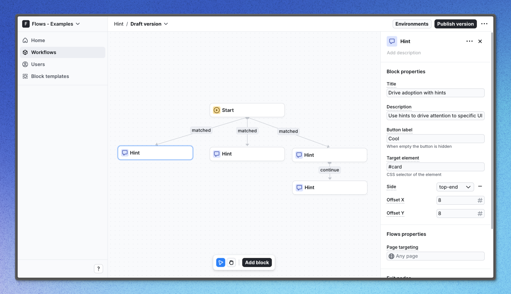

# -- PLOP TITLE HERE -- - Flows example

TODO: one sentence describing what this example demonstrates.

## Demo

[View the live demo](https://flows.sh/examples/-- PLOP EXAMPLE SLUG HERE --)

## Features

TODO: describe what the workflow does and how it behaves.

Below is a screenshot of how the workflow is set up:

## Getting started

1. Sign up for Flows if you haven't already. You can [create a free account here](https://app.flows.sh/signup).
2. Clone the repository from GitHub and install the required dependencies in the project directory.
3. Add your organization ID in the [`providers.tsx`](./src/app/providers.tsx) file.
4. Recreate the workflow in your organization and publish it.
5. Run the development server with `pnpm dev`.

## Learn more

To learn more about Flows take a look at the following resources:

- [Flows documentation](https://flows.sh/docs)
- [Join our community](https://flows.sh/join-slack)
