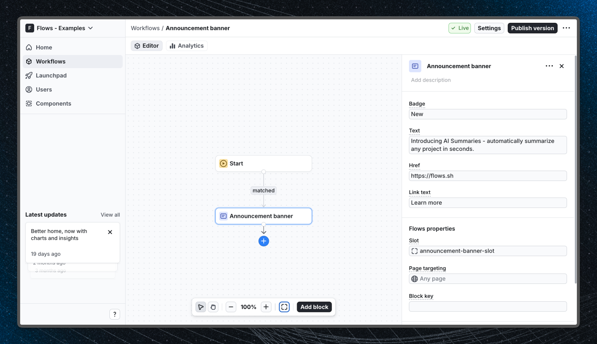

# Announcement banner - Flows example

This example shows how to display a dismissible announcement banner at the top of your React app using a custom component powered by Flows.

## Demo

[View the live demo](https://flows.sh/examples/announcement-banner)

## Features

When a user enters the workflow, an announcement banner slides in at the top of the application. The banner includes:

- A labeled badge (e.g. "New") to draw attention to the announcement
- A short message describing the feature or update
- A "Learn more" link that opens the full announcement in a new tab
- A dismiss button that advances the workflow and removes the banner

The banner is registered as a custom Flows component and rendered via a `FlowsSlot` placed above the main layout. Flows controls when the banner appears, what text it displays, and where the link points - all configurable from the workflow editor without touching the code.

Below is a screenshot of how the workflow is set up:

## Getting started

1. Sign up for Flows if you haven't already. You can [create a free account here](https://app.flows.sh/signup).
2. Clone the repository from GitHub and install the required dependencies in the project directory.
3. Add your organization ID in the [`providers.tsx`](./src/app/providers.tsx) file.
4. Recreate the announcement banner workflow using the custom `AnnouncementBanner` component block in your organization and publish it.
5. Run the development server with `pnpm dev`.

## Learn more

To learn more about Flows take a look at the following resources:

- [Flows documentation](https://flows.sh/docs)
- [Join our community](https://flows.sh/join-slack)
