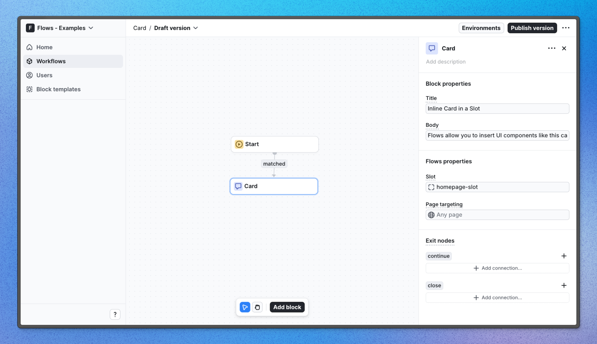

# Card example application – Flows

A custom card component built with the Flows SDK to render content inline.

This example showcases an inline card component powered by `@flows/react` which uses `FlowsSlot` to display content based on the user’s workflow state.

[View the live demo](https://flows.sh/examples/card)

Cards are particularly useful for presenting contextual information—such as new feature announcements or helpful tips—without overwhelming the user.

## Features

When a user enters the Card block in a workflow and visits the home page, the card component appears in the `homepage-slot`. In this example, the card is a custom UI element displaying a title and body text with two buttons to continue or close the card.

The card offers two exit nodes—continue and close—that allow users to either proceed to the next workflow step or close the card if more blocks are connected.

Below is a screenshot of how the Card block is set up in the workflow:

## Getting started

1. Sign up for Flows if you haven’t already. You can [create a free account here](https://app.flows.sh/signup).
2. Clone the repository from GitHub and install the required dependencies in the project directory.
3. Add your organization ID in the [`providers.tsx`](./src/app/providers.tsx) file.
4. Create a new block template in your organization with the following configuration:
   - **UI component:** FlowsCard
   - **Slottable:** true
   - **Custom properties:**
     - Title
     - Body
   - **Exit nodes:**
     - `continue`
     - `close`
5. Recreate the workflow in your organization and publish it.
6. Run the development server with `pnpm dev`.

## Learn more

To learn more about Flows take a look at the following resources:

- [Flows documentation](https://flows.sh/docs)
- [Join our community](https://flows.sh/join-slack)
