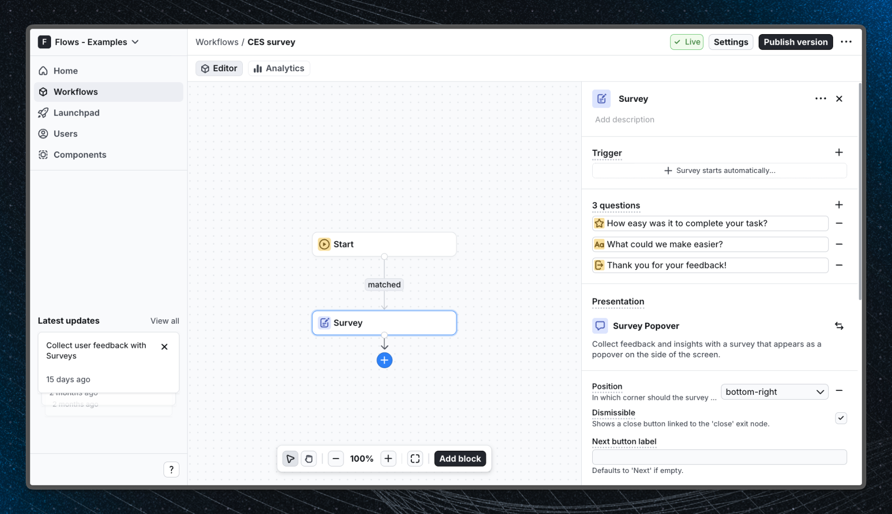

# Customer Effort Score (CES) survey - Flows example

This example shows how to collect Customer Effort Score feedback in a React app using the built-in Survey Popover component from `@flows/react-components`. The survey triggers automatically, appears in the corner of the screen, and asks users how easy it was to complete a task, without interrupting their workflow.

## Demo

[View the live demo](https://flows.sh/examples/ces-survey)

## Features

When a user enters the workflow, the survey popover appears in the bottom-right corner of the screen. The survey walks users through three steps:

1. **Effort rating**: a 1-7 scale asking how easy it was to complete the task, with "Very difficult" and "Very easy" labels at each end.
2. **Follow-up question**: an open-ended freeform text field asking what could be made easier. Marked as optional so users can skip it.
3. **End screen**: a thank-you message acknowledging the response before the popover closes automatically.

The workflow uses the Auto proceed after answer option on the rating step so the popover advances as soon as the user selects a score, reducing friction. The Auto close after submit option closes the popover once the end screen is reached.

Below is a screenshot of how the workflow is set up:

## Getting started

1. Sign up for Flows if you haven't already. You can [create a free account here](https://app.flows.sh/signup).
2. Clone the repository from GitHub and install the required dependencies in the project directory.
3. Add your organization ID in the [`providers.tsx`](./src/app/providers.tsx) file.
4. Recreate the CES survey workflow using the **Survey** block in your organization and publish it.
5. Run the development server with `pnpm dev`.

## Learn more

To learn more about Flows take a look at the following resources:

- [Flows documentation](https://flows.sh/docs)
- [Join our community](https://flows.sh/join-slack)
