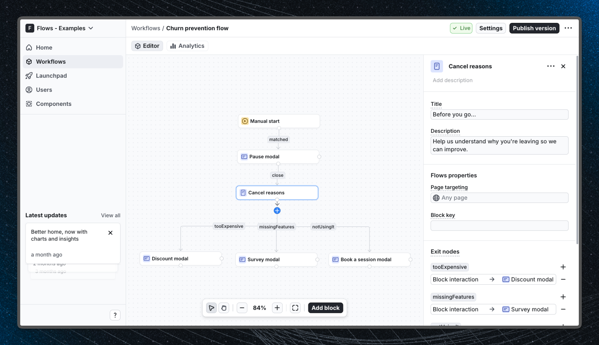

# Churn prevention flow - Flows example

This example demonstrates how to build a multi-step churn prevention flow that intercepts subscription cancellation attempts and guides users through a pause offer, a reason survey with per-reason branching, and targeted retention offers.

## Demo

[View the live demo](https://flows.sh/examples/churn-prevention-flow)

## Features

The "Cancel subscription" button in the current plan section calls `startWorkflow()` to trigger the churn prevention workflow. The workflow walks users through:

1. **Pause offer** - a Modal block asking if the user wants to pause their subscription instead of cancelling.
2. **Cancel reasons** - a custom `CancelReasons` component showing five cancellation reasons, each wired to its own exit node so the workflow can branch differently per reason.
3. **Targeted retention offer** - price-sensitive users see a discount modal, users who cite missing features see a feedback modal, and users who say they're not using the product are offered a free onboarding session.

The custom `CancelReasons` component uses `ComponentProps` from `@flows/react` and exposes one `() => void` prop per reason (`tooExpensive`, `missingFeatures`, `notUsingIt`, `switchingToCompetitor`, `other`) plus a `close` prop. Each prop maps to an exit node in Flows, enabling the workflow to route users to different next steps based on their answer.

Below is a screenshot of how the workflow is set up:

## Getting started

1. Sign up for Flows if you haven't already. You can [create a free account here](https://app.flows.sh/signup).
2. Clone the repository from GitHub and install the required dependencies in the project directory.
3. Add your organization ID in the [`providers.tsx`](./src/app/providers.tsx) file.
4. Create the `CancelReasons` custom component in your Flows organization with the properties and exit nodes described in the source code, then recreate the full churn prevention workflow using the **Manual start**, **Modal**, and **CancelReasons** blocks, and publish it.
5. Run the development server with `pnpm dev`.

## Learn more

To learn more about Flows take a look at the following resources:

- [Flows documentation](https://flows.sh/docs)
- [Join our community](https://flows.sh/join-slack)
