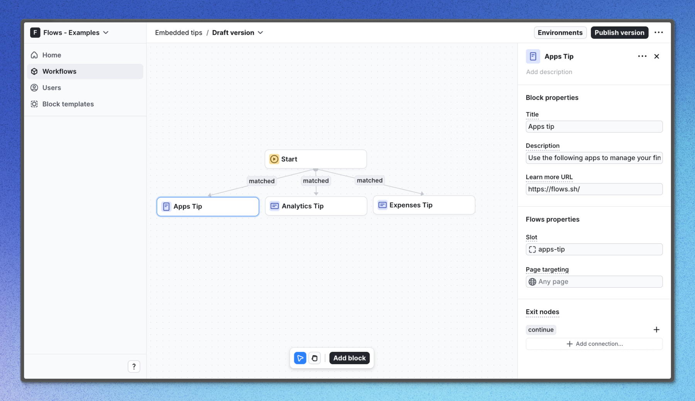

# Embedded tips – Flows example

This example shows how to use Flows to build contextual, embedded tips to onboard users. Each page has a simple tip that helps users learn about important product and UI concepts.

## Demo

[View the live demo](https://flows.sh/examples/embedded-tips)

## Features

When a user enters the workflow and visits one of the pages with `FlowsSlot` components, an inline tip will appear to help them learn about the features on the page. Each tip uses a custom component to render the content.

Below is a screenshot of how the workflow is set up:

## Getting started

1. Sign up for Flows if you haven’t already. You can [create a free account here](https://app.flows.sh/signup).
2. Clone the repository from GitHub and install the required dependencies in the project directory.
3. Add your organization ID in the [`providers.tsx`](./src/app/providers.tsx) file.
4. Create three block templates based on the components found in [`src/components/flows`](./src/components/flows).
5. Recreate the workflow in your organization and publish it.
6. Run the development server with `pnpm dev`.

## Learn more

To learn more about Flows take a look at the following resources:

- [Flows documentation](https://flows.sh/docs)
- [Join our community](https://flows.sh/join-slack)
