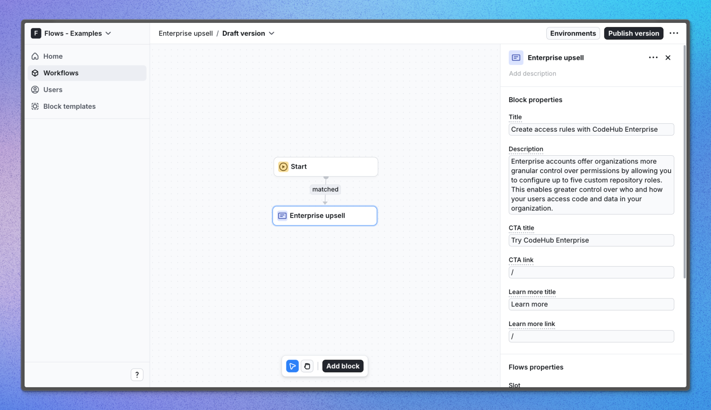

# Enterprise upsell – Flows example

This example showcases enterprise upsell card powered by `@flows/react`. In-page promotion is one of the most effective channels for product upsell especially compared to email outreach. This upsell card strikes the balance between being informative and non-intrusive. It is designed to meet the user at the right moment when they are most likely to be interested in the product.

## Demo

[View the live demo](https://flows.sh/examples/enterprise-upsell)

## Features

When a user that doesn’t have an enterprise plan visits the page, they will see a card that promotes the enterprise plan in a non-intrusive way. The card is designed to be informative and not obstructive to the user experience. The user can use the cards buttons to upgrade, learn more or dismiss the card altogether.

Below is a screenshot of how the workflow is set up:

## Getting started

1. Sign up for Flows if you haven’t already. You can [create a free account here](https://app.flows.sh/signup).
2. Clone the repository from GitHub and install the required dependencies in the project directory.
3. Add your organization ID in the [`providers.tsx`](./src/app/providers.tsx) file.
4. Create a new component in your organization with the following configuration:
   - **UI component:** EnterpriseUpsell
   - **Slottable:** true
   - **Custom properties:**
     - Title
     - Description
     - CTA title
     - CTA link
     - Learn more title
     - Learn more link
   - **Exit nodes:**
     - `continue`
     - `close`
5. Recreate the workflow in your organization and publish it.
6. Run the development server with `pnpm dev`.

## Learn more

To learn more about Flows take a look at the following resources:

- [Flows documentation](https://flows.sh/docs)
- [Join our community](https://flows.sh/join-slack)
