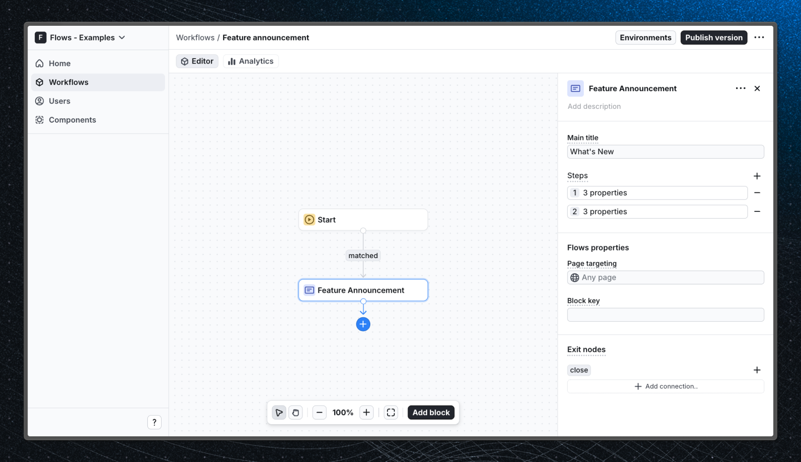

# Feature announcement – Flows example

This example showcases a full page dialog feature announcement powered by `@flows/react` to announce a new feature to users.

Feature announcements are a great way to introduce new features to users and help them understand how they work, however they can sometimes be dismissed too quickly if they interrupt the user’s workflow.

## Demo

[View the live demo](https://flows.sh/examples/feature-announcement)

## Features

When an existing user comes back to the app the feature announcement will be displayed to them right away. In this example the dialog is a custom UI component that is made up of multiple steps that explain the new feature.

Below is a screenshot of how the workflow is set up:

## Getting started

1. Sign up for Flows if you haven’t already. You can [create a free account here](https://app.flows.sh/signup).
2. Clone the repository from GitHub and install the required dependencies in the project directory.
3. Add your organization ID in the [`providers.tsx`](./src/app/providers.tsx) file.
4. Create a new component in your organization with the following configuration:
   - **UI component:** [FeatureAnnouncement](./src/components/feature-announcement.tsx)
   - **Slottable:** false
   - **Custom properties:**
     - Title
     - Steps (array):
       - Title
       - Description
       - Illustration
   - **Exit nodes:**
     - `close`
5. Recreate the workflow in your organization and publish it.
6. Run the development server with `pnpm dev`.

## Learn more

To learn more about Flows take a look at the following resources:

- [Flows documentation](https://flows.sh/docs)
- [Join our community](https://flows.sh/join-slack)
