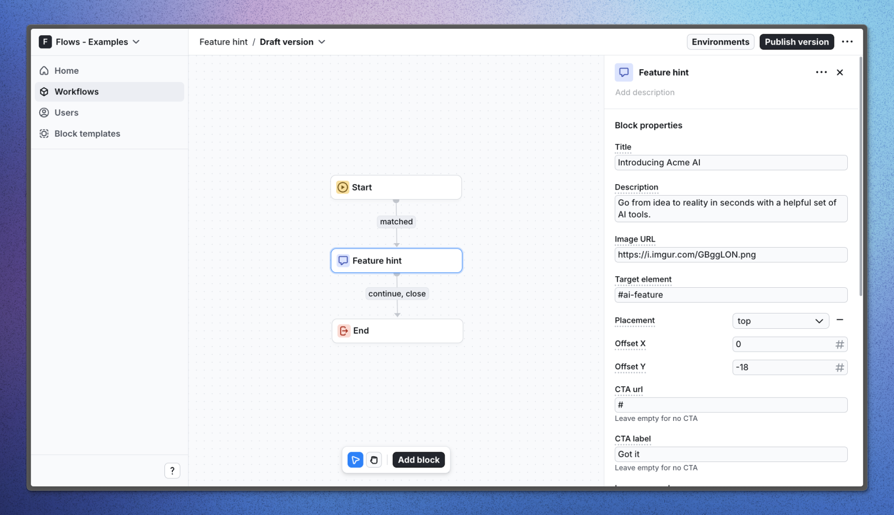

# Feature hint – Flows example

This example showcases a custom feature hint component that can be used to highlight new features in your product. The component is designed to be dismissible, allowing users to easily close it once they have acknowledged the new feature. The feature hint is built using the `@flows/react` and `@floating-ui/react` SDKs, and uses Flows to manage its state and behavior.

The component has two optional buttons: a primary button used to acknowledge the new feature and a secondary button that can be used to link to a page with more information about the feature or announcement post.

## Demo

[View the live demo](https://flows.sh/examples/feature-hint)

## Features

When user enters the workflow and visits the home page, the feature hint will be displayed floating above the new Acme AI feature icon.

Below is a screenshot of how the workflow is set up:

## Getting started

1. Sign up for Flows if you haven’t already. You can [create a free account here](https://app.flows.sh/signup).
2. Clone the repository from GitHub and install the required dependencies in the project directory.
3. Add your organization ID in the [`providers.tsx`](./src/app/providers.tsx) file.
4. Create a new component in your organization with the following configuration:
   - **UI component:** [FeatureHint](./src/components/feature-hint.tsx)
   - **Slottable:** false
   - **Custom properties:**
     - Title
     - Description
     - Image URL
     - Target element
     - Placement: top, right, bottom, left
     - Offset: number
     - CTA label
     - CTA URL
     - Learn more label
     - Learn more URL
   - **Exit nodes:**
     - `continue`
     - `close`
5. Recreate the workflow in your organization and publish it.
6. Run the development server with `pnpm dev`.

## Learn more

To learn more about Flows take a look at the following resources:

- [Flows documentation](https://flows.sh/docs)
- [Join our community](https://flows.sh/join-slack)
