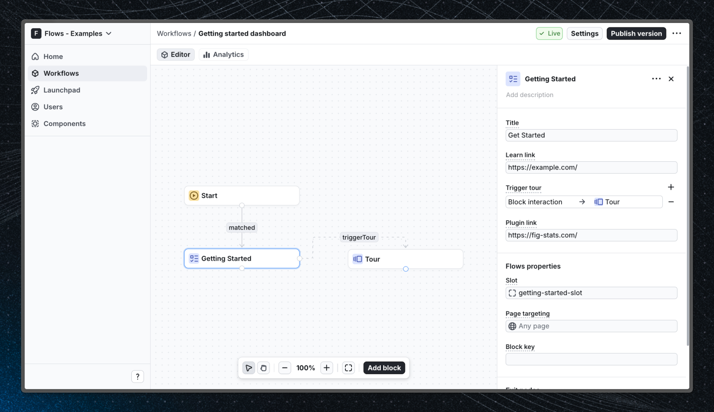

# Getting started dashboard – Flows example

This example showcases a getting started dashboard powered by `@flows/react` to help onboard new users to your application.

A getting started dashboard is a centralized location where users can find resources, tutorials, and tips to help them get started with your application. It can also provide quick access to important features and settings.

## Demo

[View the live demo](https://flows.sh/examples/getting-started-dashboard)

## Features

When a user open the application, they are greeted onboarding dashboard, which contains a demo video, a link to a list of tutorials, and a button to launch an interactive tour.

Below is a screenshot of how the workflow is set up:

## Getting started

1. Sign up for Flows if you haven’t already. You can [create a free account here](https://app.flows.sh/signup).
2. Clone the repository from GitHub and install the required dependencies in the project directory.
3. Add your organization ID in the [`providers.tsx`](./src/app/providers.tsx) file.
4. Create a new component in your organization with the following configuration:
   - UI component: GettingStarted
   - Slottable: true
   - Custom properties:
     - Title
     - Learn link
     - Trigger tour
     - Plugin link
   - Exit nodes:
     - close
5. Recreate the workflow in your organization and publish it.
6. Run the development server with `pnpm dev`.

## Learn more

To learn more about Flows take a look at the following resources:

- [Flows documentation](https://flows.sh/docs)
- [Join our community](https://flows.sh/join-slack)
