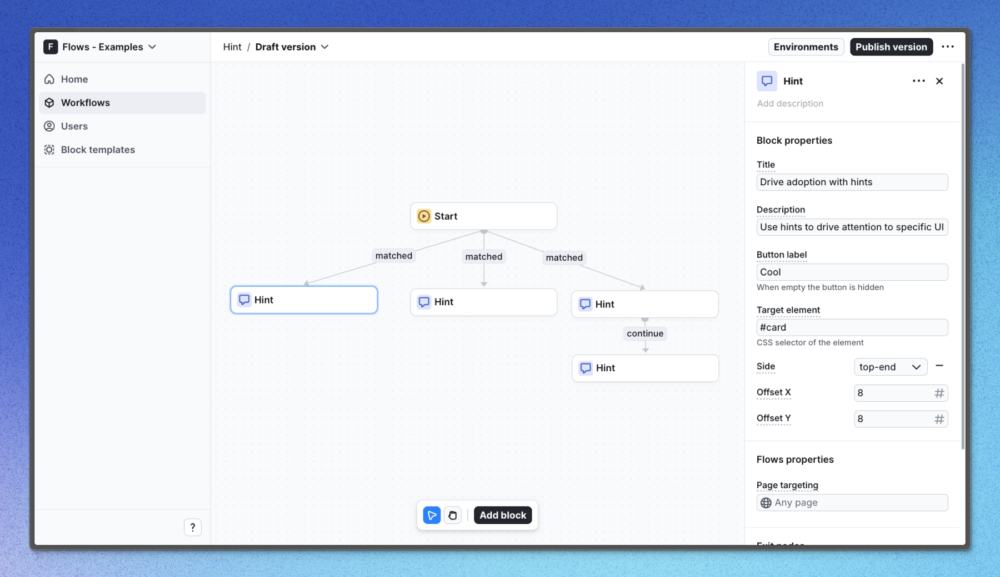

# Hint example application – Flows example

This example showcases a set of custom hints powered by `@flows/react` which uses `@floating-ui/react-dom`.

Hints provide users with on-demand and contextual guidance. Hints use small beacons that encourage users to focus on certain features, then progressively disclose more information when the user interacts with them.

Hints are useful for:

- Contextual education and help
- To draw attention to a new feature without interrupting a user’s workflow.
- Gently nudge users to explore, learn, or take action.

## Demo

[View the live demo](https://flows.sh/examples/hint)

## Features

WhWhen a user enters the workflow and visits the home page, three hints are shown to gently nudge users to explore the features of the application. The hint next to the description label is linked to another hint that shows up after the previous hint is completed.

Below is a screenshot of how the workflow is set up:

## Getting started

1. Sign up for Flows if you haven’t already. You can [create a free account here](https://app.flows.sh/signup).
2. Clone the repository from GitHub and install the required dependencies in the project directory.
3. Add your organization ID in the [`providers.tsx`](./src/app/providers.tsx) file.
4. Create a new block template in your organization with the following configuration:
   - **UI component:** FlowsHint
   - **Slottable:** false
   - **Custom properties:**
     - Title
     - Body
     - Button label
     - Target element
     - Side: top, right, bottom, left
     - Offset X: number
     - Offset Y: number
   - **Exit nodes:**
     - `continue`
     - `close`
5. Recreate the workflow in your organization and publish it.
6. Run the development server with `pnpm dev`.

## Learn more

To learn more about Flows take a look at the following resources:

- [Flows documentation](https://flows.sh/docs)
- [Join our community](https://flows.sh/join-slack)
