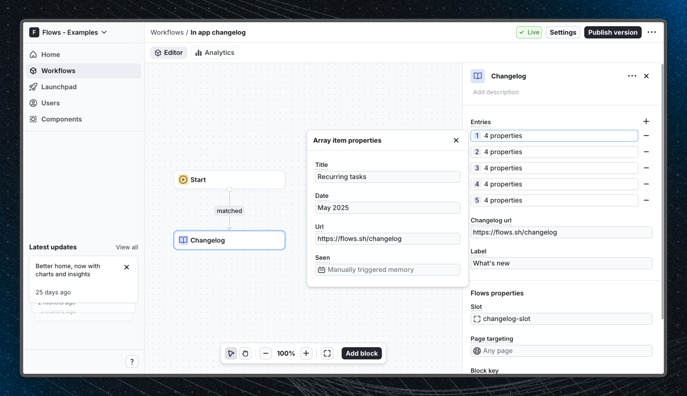

# In-App Changelog - Flows example

This example demonstrates how to build a persistent in-app changelog button with a popover that tracks which entries each user has already read.

## Demo

[View the live demo](https://flows.sh/examples/in-app-changelog)

## Features

A custom `ChangelogButton` component is injected into the app sidebar via a `FlowsSlot`. When clicked, it opens a popover listing recent product updates - each entry links to the full changelog.

Each entry has a **state memory** property that tracks whether the user has seen it. An entry is marked as seen after the user hovers over it for 2 seconds (or clicks it immediately). Unseen entries show a blue dot, and the button itself shows a badge with the total unseen count. All seen state is persisted per user by Flows - no backend code required.

Below is a screenshot of how the workflow is set up:

## Getting started

1. Sign up for Flows if you haven't already. You can [create a free account here](https://app.flows.sh/signup).
2. Clone the repository from GitHub and install the required dependencies in the project directory.
3. Add your organization ID in the [`providers.tsx`](./src/app/providers.tsx) file.
4. Recreate the changelog workflow using the **Slottable** block, target the `changelog-slot` slot, select `ChangelogButton` as the component, and add your entries - each with a `seen` property set to **State memory**.
5. Run the development server with `pnpm dev`.

## Learn more

To learn more about Flows take a look at the following resources:

- [Flows documentation](https://flows.sh/docs)
- [Join our community](https://flows.sh/join-slack)
