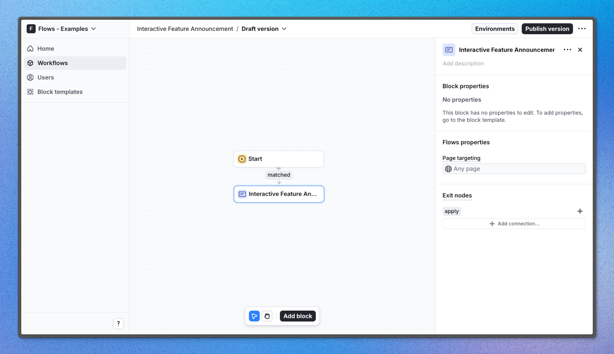

# Interactive feature announcement – Flows example

This example showcases an interactive feature announcement powered by `@flows/react` to announce a new feature and give users a preview of how it works.

Interactive feature announcements are a great way to introduce new features to users and help them understand how they work. Instead of just telling users about a new feature, you can show them how it works in an interactive way.

## Demo

[View the live demo](https://flows.sh/examples/interactive-feature-announcement)

## Features

When a user enters the Interactive Feature Announcement block in a workflow and, a modal appears. In this example, the modal is a custom UI component announcing the release of a dark mode support to the app. The modal gives users the option to select which theme they want to use (light, dark, or system default).

Below is a screenshot of how the workflow is set up:

## Getting started

1. Sign up for Flows if you haven’t already. You can [create a free account here](https://app.flows.sh/signup).
2. Clone the repository from GitHub and install the required dependencies in the project directory.
3. Add your organization ID in the [`providers.tsx`](./src/app/providers.tsx) file.
4. Create a new component in your organization with the following configuration:
   - **UI component:** AnnouncementModal
   - No other configuration is required for this example.
5. Recreate the workflow in your organization and publish it.
6. Run the development server with `pnpm dev`.

## Learn more

To learn more about Flows take a look at the following resources:

- [Flows documentation](https://flows.sh/docs)
- [Join our community](https://flows.sh/join-slack)
