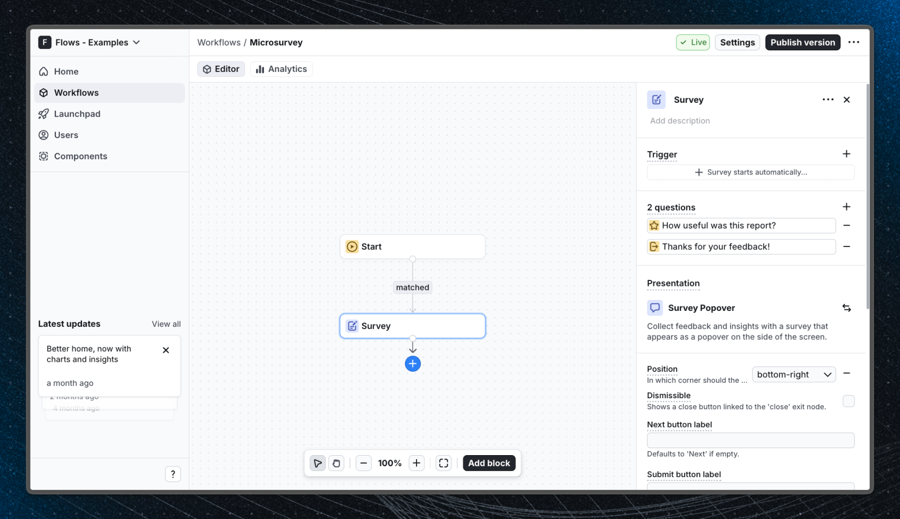

# Microsurvey - Flows example

This example demonstrates a 5-point emoji microsurvey embedded in a React analytics dashboard, powered by Flows.

## Demo

[View the live demo](https://flows.sh/examples/microsurvey)

## Features

The Flows workflow shows a 5-point emoji reaction widget (from very unhappy to very happy) to users after they open the analytics report. The survey appears automatically as a non-intrusive overlay - no page navigation required. Users submit their rating with a single click and the response is captured by Flows. The low-friction format makes it ideal for collecting quick in-app feedback on reports, dashboards, or any feature.

Below is a screenshot of how the workflow is set up:

## Getting started

1. Sign up for Flows if you haven't already. You can [create a free account here](https://app.flows.sh/signup).
2. Clone the repository from GitHub and install the required dependencies in the project directory.
3. Add your organization ID in the [`providers.tsx`](./src/app/providers.tsx) file.
4. Recreate the microsurvey workflow in your organization using the **Survey** block with a 5-point emoji rating scale and publish it.
5. Run the development server with `pnpm dev`.

## Learn more

To learn more about Flows take a look at the following resources:

- [Flows documentation](https://flows.sh/docs)
- [Join our community](https://flows.sh/join-slack)
