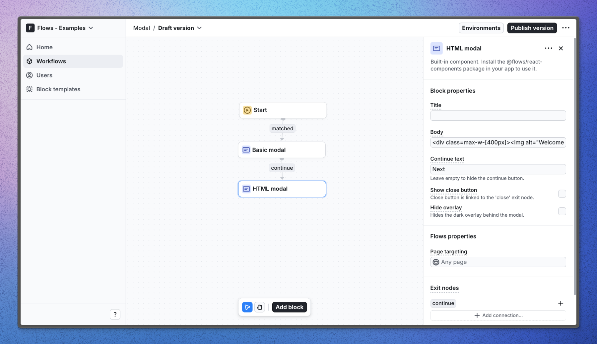

# Modal – Flows example

This example showcases a modal powered by `@flows/react-components`.

Modals are useful to focus the user’s attention on just one thing. But since they are disruptive by design, only use them when necessary to avoid annoying your users.

Use modals to welcome new users to your app, announce major updates, or give users timely warnings and alerts.

## Demo

[View the live demo](https://flows.sh/examples/modal)

## Features

When a user opens the application for the first time, they encounter a simple modal, followed by a modal with custom HTML content.

Below is a screenshot of how the workflow is set up:

## Getting started

1. Sign up for Flows if you haven’t already. You can [create a free account here](https://app.flows.sh/signup).
2. Clone the repository from GitHub and install the required dependencies in the project directory.
3. Add your organization ID in the [`providers.tsx`](./src/app/providers.tsx) file.
4. Recreate the workflow in your organization and publish it.
5. Run the development server with `pnpm dev`.

## Learn more

To learn more about Flows take a look at the following resources:

- [Flows documentation](https://flows.sh/docs)
- [Join our community](https://flows.sh/join-slack)
