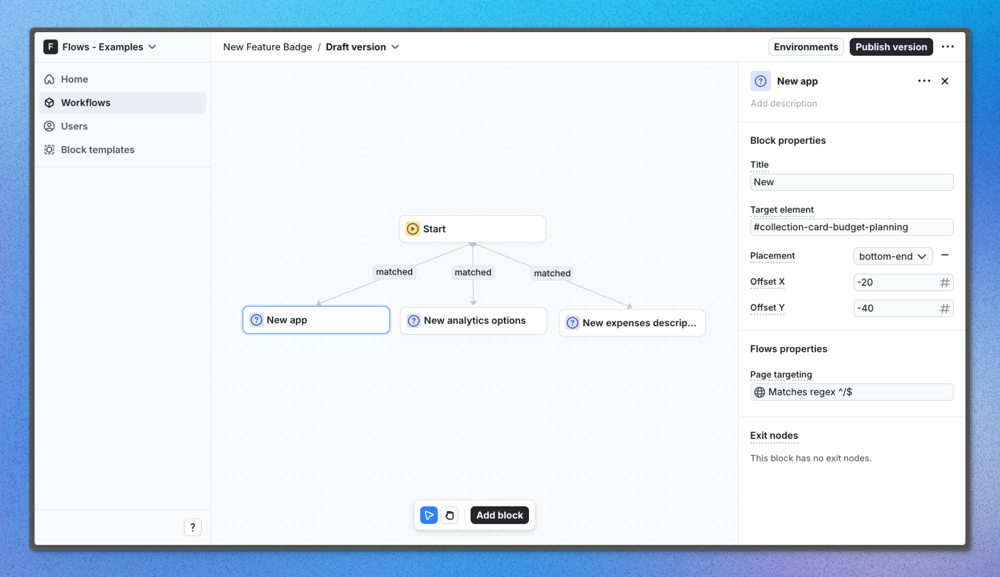

# New feature badge – Flows example

This example showcases new feature badge powered by `@flows/react` and `floating-ui`.

The badge is a small, floating element that can be positioned next to a new feature's name, location, or any component you want to emphasize. It effectively draws attention to updates and changes in your application.

As products continuously evolve, keeping users informed is essential. The new feature badge offers a straightforward and effective way to communicate these changes.

## Demo

[View the live demo](https://flows.sh/examples/new-feature-badge)

## Features

When a user enters the workflow and visits one of the application pages, a new feature badge will appear next a specific element on the page, helping to draw attention to the new feature. The badge is using a custom component to create a floating element that can be positioned anywhere on the page.

Below is a screenshot of how the workflow is set up:

## Getting started

1. Sign up for Flows if you haven’t already. You can [create a free account here](https://app.flows.sh/signup).
2. Clone the repository from GitHub and install the required dependencies in the project directory.
3. Add your organization ID in the [`providers.tsx`](./src/app/providers.tsx) file.
4. Create a new block template in your organization with the following configuration:
   - **UI component:** NewFeatureBadge
   - **Slottable:** false
   - **Custom properties:**
     - Title
     - Target element
     - Side: top, right, bottom, left
     - Offset X: number
     - Offset Y: number
   - **Exit nodes:**
     - No exit nodes
5. Recreate the workflow in your organization and publish it.
6. Run the development server with `pnpm dev`.

## Learn more

To learn more about Flows take a look at the following resources:

- [Flows documentation](https://flows.sh/docs)
- [Join our community](https://flows.sh/join-slack)
