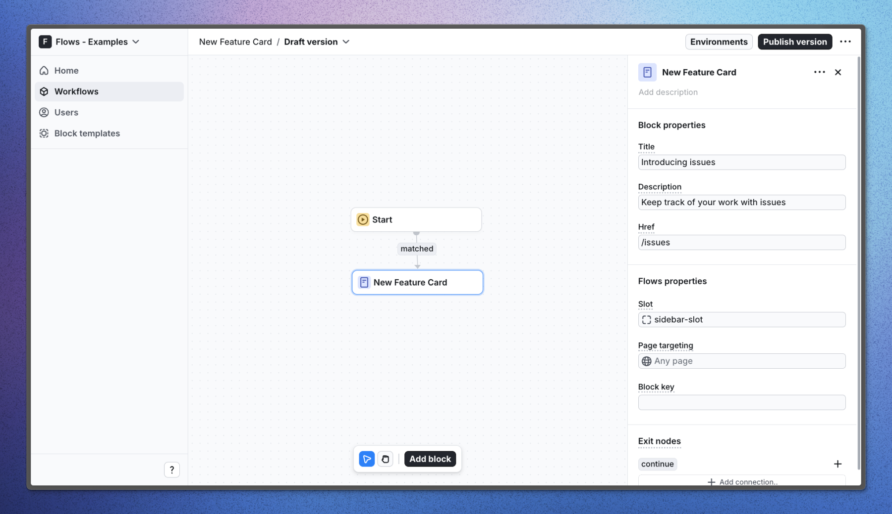

# New feature card – Flows example

This example showcases announcement card powered by `@flows/react`. The card is displayed in the sidebar of your app and can be used to announce new features, product launches, or marketing efforts.

The card is interactive and can be clicked to view more details of visit the feature. Once clicked, the card will redirect the user to the destination URL and mark the card as read.

## Demo

[View the live demo](https://flows.sh/examples/new-feature-card)

## Features

If users matches your criteria, they will enter the workflow and see the card in the sidebar. The card will be displayed until the user clicks on it or the workflow is turned off.

You can customize the text, description, and url of the card in the workflow settings. The illustration is fixed, but could be replaced with a custom image.

Below is a screenshot of how the workflow is set up:

## Getting started

1. Sign up for Flows if you haven’t already. You can [create a free account here](https://app.flows.sh/signup).
2. Clone the repository from GitHub and install the required dependencies in the project directory.
3. Add your organization ID in the [`providers.tsx`](./src/app/providers.tsx) file.
4. Create a new component in your organization with the following configuration:
   - **UI component:** NewFeatureCard
   - **Slottable:** false
   - **Custom properties:**
     - Title
     - Description
     - Href
   - **Exit nodes:**
     - continue
5. Recreate the workflow in your organization and publish it.
6. Run the development server with `pnpm dev`.

## Learn more

To learn more about Flows take a look at the following resources:

- [Flows documentation](https://flows.sh/docs)
- [Join our community](https://flows.sh/join-slack)
