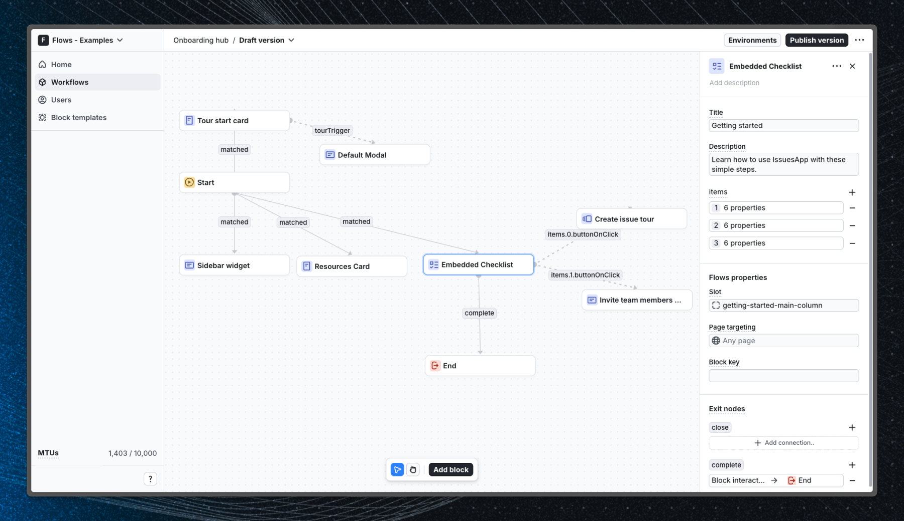

# Onboarding hub – Flows example

This example showcases an onboarding hub with a checklist powered by `@flows/react`.

An onboarding hub is a home in your app for onboarding and help resources. They’re super
flexible and could include a getting started checklist, general tips for the best next step,
and entry points to interactive tours, documentation, and support. The onboarding hub
typically has a permanent place in the navigation until dismissed or completed.

## Demo

[View the live demo](https://flows.sh/examples/onboarding-hub)

## Features

When a user open the application, they are greeted with a sidebar widget that calls out the
getting started page. The user can click on the widget to open the onboarding hub, which
contains a checklist of suggested setup actions, a button to launch a product tour, and a
list of useful links to documentation and support resources.

Below is a screenshot of how the workflow is set up:

## Getting started

1. Sign up for Flows if you haven’t already. You can [create a free account here](https://app.flows.sh/signup).
2. Clone the repository from GitHub and install the required dependencies in the project directory.
3. Add your organization ID in the [`providers.tsx`](./src/app/providers.tsx) file.
4. Recreate the workflow in your organization and publish it.
5. Run the development server with `pnpm dev`.

## Learn more

To learn more about Flows take a look at the following resources:

- [Flows documentation](https://flows.sh/docs)
- [Join our community](https://flows.sh/join-slack)
