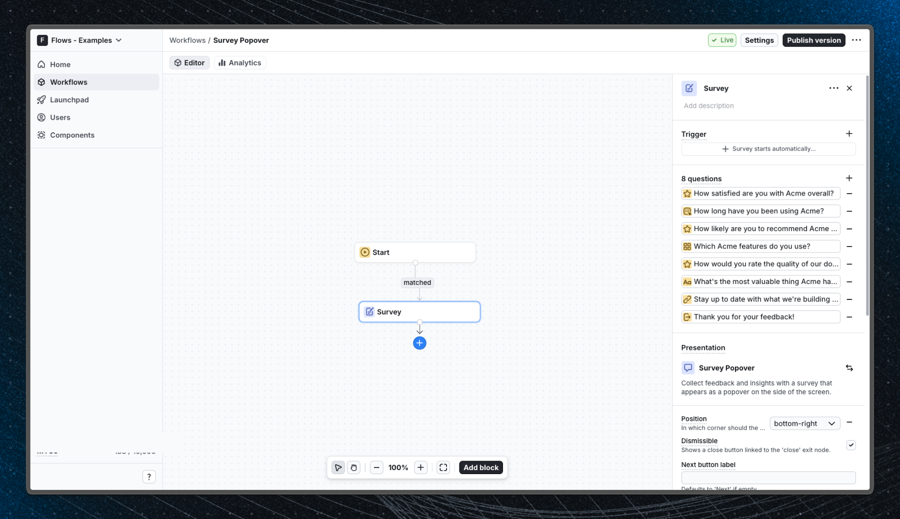

# Survey Popover - Flows example

This example showcases a built-in survey popover component that appears in the corner of the screen and collects structured feedback from users without interrupting their workflow.

## Demo

[View the live demo](https://flows.sh/examples/survey-popover)

## Features

When a user enters the workflow, the survey popover appears in the bottom-right corner of the screen. Users can answer one question at a time and navigate through the survey with Next and Submit buttons.

Below is a screenshot of how the workflow is set up:

## Getting started

1. Sign up for Flows if you haven't already. You can [create a free account here](https://app.flows.sh/signup).
2. Clone the repository from GitHub and install the required dependencies in the project directory.
3. Add your organization ID in the [`providers.tsx`](./src/app/providers.tsx) file.
4. Recreate the workflow using the **Survey** block in your organization and publish it.
5. Run the development server with `pnpm dev`.

## Learn more

To learn more about Flows take a look at the following resources:

- [Flows documentation](https://flows.sh/docs)
- [Join our community](https://flows.sh/join-slack)
