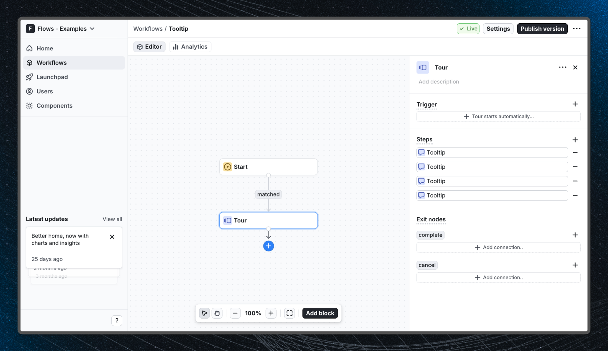

# Tooltip - Flows example

Highlight key UI elements and guide users through your product with contextual in-app tooltips powered by Flows.

## Demo

[View the live demo](https://flows.sh/examples/tooltip)

## Features

This example shows a 4-step tooltip workflow that points users to the most important parts of an analytics dashboard:

1. **Stats row** - Draws attention to the KPI cards at the top of the dashboard so users understand what metrics are tracked.
2. **Main chart** - Points to the visitors-over-time chart and explains how to read the data.
3. **Top pages** - Highlights the top-pages panel and explains how to drill into individual pages.
4. **Create report button** - Ends the tour by pointing users to the action that creates a new report.

Each step uses the built-in `BasicsV2Tooltip` component from `@flows/react-components/tour`, which anchors a floating tooltip to a CSS selector on the page. Steps advance with a "Next" button and users can dismiss the tour at any time.

Below is a screenshot of how the workflow is set up:

## Getting started

1. Sign up for Flows if you haven't already. You can [create a free account here](https://app.flows.sh/signup).
2. Clone the repository from [GitHub](https://github.com/RBND-studio/flows.sh/tree/main/examples/tooltip) and install the required dependencies in the project directory.
3. Add your organization ID in the [`providers.tsx`](./src/app/providers.tsx) file.
4. Recreate the tooltip tour workflow using the built-in **Tooltip** block from `@flows/react-components` and target the element IDs used in `home.tsx` (`#stats-row`, `#main-chart`, `#top-pages`, `#create-report-button`).
5. Run the development server with `pnpm dev`.

## Learn more

To learn more about Flows take a look at the following resources:

- [Flows documentation](https://flows.sh/docs)
- [Join our community](https://flows.sh/join-slack)
