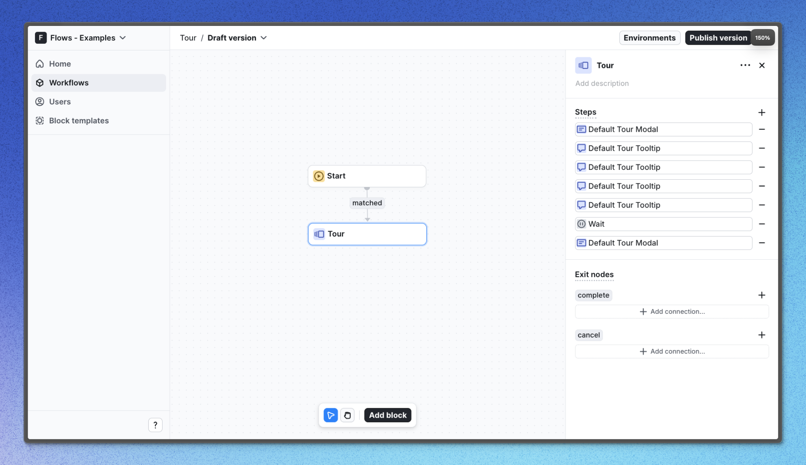

# Tour example application – Flows example

This example showcases an inline card component powered by `@flows/react` and the built-in components from `@flows/react-components`.

Tours are multi-step flows used to guide users through new, undiscovered, or changed products and features.

Good tours:

- Are concise and direct (try to limit them to five steps).
- Match the user’s context (don’t show a tour for a feature the user has already explored).
- Use short, meaningful copy.

## Demo

[View the live demo](https://flows.sh/examples/tour)

## Features

When a user opens the application for the first time, they encounter a welcome modal, followed by a series of steps that showcase various features of Flows. Modal, Tooltip, and Hint components are built-in components from `@flows/react-components`, while the inline card component is custom-built and can be found in the [`custom-card.tsx`](./src/components/custom-card.tsx) file.

Below is a screenshot demonstrating the workflow configuration for this Tour example:

Visit the [Live demo](https://flows.sh/examples/tour) to learn about the full setup.

## Getting started

1. Sign up for Flows if you haven’t already. You can [create a free account here](https://app.flows.sh/signup).
2. Clone the repository from GitHub and install the required dependencies in the project directory.
3. Add your organization ID in the [`providers.tsx`](./src/app/providers.tsx) file.
4. Create a new component in your organization with the following configuration:
   - Component type: Tour component
   - UI component: [CustomCard](./src/components/custom-card.tsx)
   - Slottable: true
   - Custom properties:
     - Title
     - Description
5. Recreate the workflow in your organization and publish it.
6. Run the development server with `pnpm dev`.

## Learn more

To learn more about Flows take a look at the following resources:

- [Flows documentation](https://flows.sh/docs)
- [Join our community](https://flows.sh/join-slack)
